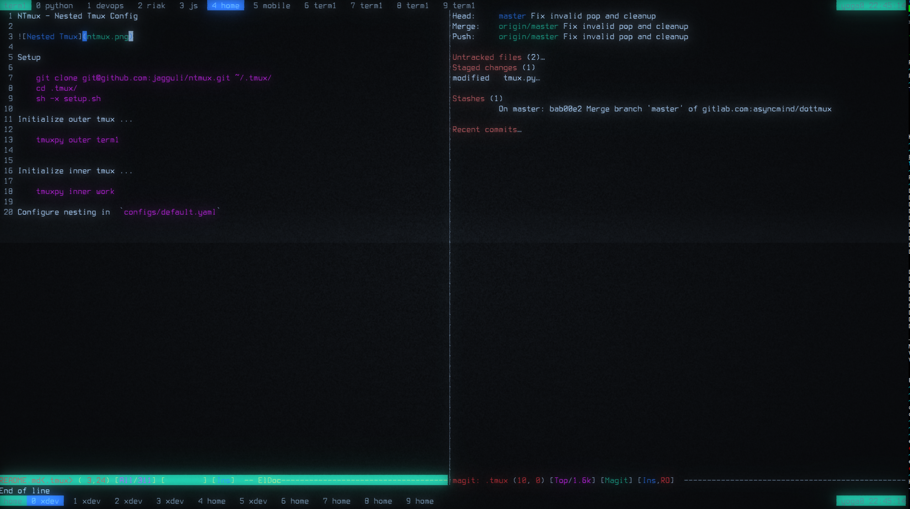

# NTmux - Nested Tmux Config

## Description:

NTmux is the perfect solution for power users looking to manage their terminal sessions more efficiently. NTmux builds on the popular tmux terminal multiplexer, providing an intuitive and easy-to-use interface for navigating through a large number of panes.

With NTmux, you can easily organize your panes into logical groups, making it easier to switch between different tasks and projects. And thanks to advanced nesting capabilities, you can create complex configurations that let you easily access the panes you need, when you need them.

Whether you're a developer working on multiple projects, or just someone looking to be more productive in their terminal, NTmux has you covered. Give it a try and see the difference for yourself.

## Setup

    git clone git@github.com:jagguli/ntmux.git ~/.tmux/
    cd .tmux/
    sh -x setup.sh

Initialize outer tmux ...

    tmuxpy outer term1
    
    
Initialize inner tmux ...

    tmuxpy inner work
    
Configure nesting in  `configs/default.yaml`
